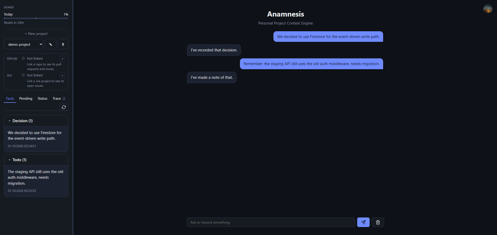
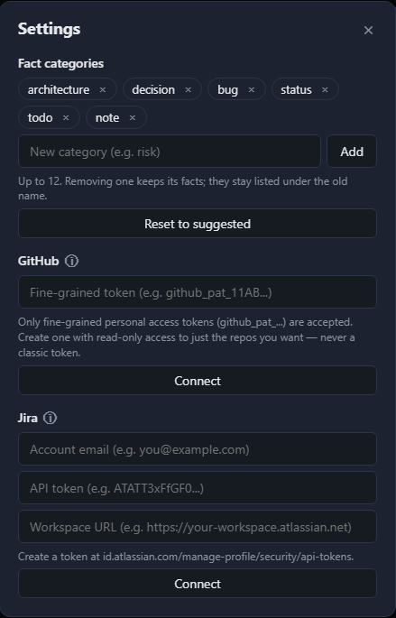
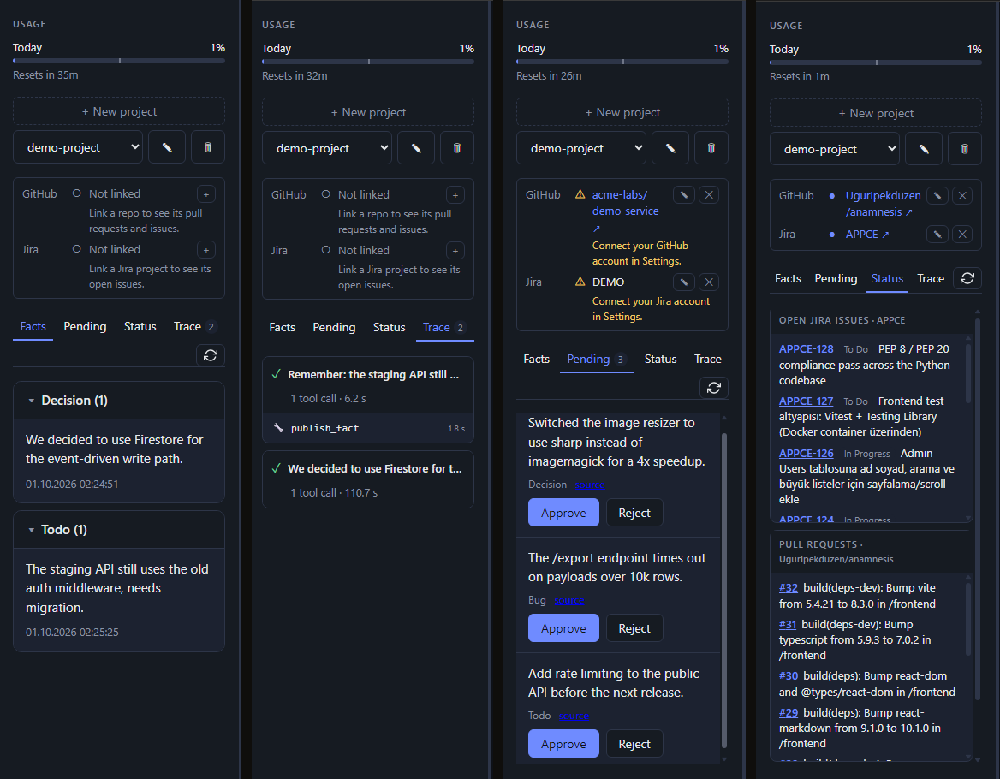
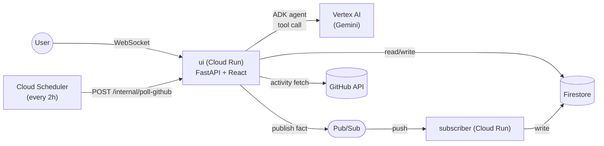

# Anamnesis: Personal Project Context Engine

> What's true about your projects, you say in chat — or it reads it straight from GitHub/Jira.

<table>
  <tr>
    <td width="33%">
      <a href="screenshots/chat.png"></a>
      <p align="center"><sub>Chat — recording and querying facts in natural language (click for full size)</sub></p>
    </td>
    <td width="33%">
      <a href="screenshots/settings.png"></a>
      <p align="center"><sub>Settings — connecting GitHub/Jira (click for full size)</sub></p>
    </td>
    <td width="33%">
      <a href="screenshots/facts_trace_pending_status.png"></a>
      <p align="center"><sub>Facts · Trace · Pending · Status panels (click for full size)</sub></p>
    </td>
  </tr>
</table>

Anamnesis is a personal, multi-user "context engine" for a developer working
on several projects at once. Each project is a tenant; facts like
architecture decisions, bugs, TODOs, and status are recorded in natural
language through a chat agent (Google ADK) and stored in Firestore, with the
write path handled event-driven over Pub/Sub. GitHub and Jira can each be
connected per project, optionally, to extract facts automatically from real
activity (PRs, issues, tickets).

The FastAPI backend and React frontend are served together from a single
Cloud Run service. Network-level access is public; real authorization is
enforced inside the app via Google Sign-In + an email allowlist.

## Table of Contents

- [Features](#features)
- [Architecture](#architecture)
- [When the LLM Is Used](#when-the-llm-is-used)
- [Project Structure](#project-structure)
  - [Dependency Direction](#dependency-direction)
  - [Where New Code Goes](#where-new-code-goes)
  - [General Rules](#general-rules)
  - [Entry Points That Must Not Move](#entry-points-that-must-not-move)
  - [Not Done Yet](#not-done-yet)
- [Prerequisites](#prerequisites)
- [First-Time GCP Setup](#first-time-gcp-setup)
- [Deploying](#deploying)
- [Local Development](#local-development)
- [Environment Variables](#environment-variables)
- [Configuration](#configuration)
- [API](#api)
- [Code Quality](#code-quality)
- [Access Control](#access-control)
- [Access / Requesting a Test Invite](#access--requesting-a-test-invite)
- [Cost](#cost)
- [Encryption Key: Rotation and Recovery](#encryption-key-rotation-and-recovery)
- [Contributing](#contributing)
- [License](#license)

## Features

- **Fact recording via natural-language chat** — say "we decided on X for
  this project", the agent (Gemini, Google ADK) writes it to Firestore under
  the right category
- **Categories** — each user has their own fact categories (architecture,
  bug, decision, risk...), editable from Settings
- **GitHub integration** — a connected repo's PR/issue activity is scanned
  periodically, turned into facts by the LLM, and lands in the approval
  queue (Pending)
- **Jira integration** — live ticket status and recently completed work can
  be queried from chat (not a separate record, just live data)
- **Pending facts approval flow** — every fact the model proposes goes
  through user approval before it's saved, with a warning if it looks like
  an already-recorded fact
- **Project-linking suggestions** — saying "link this repo" in chat shows a
  card; the actual link only happens once the user confirms it with a
  button
- **Trace panel** — a debug view showing which tools were called with which
  arguments during a chat turn
- **Admin panel** — user allowlist management, usage stats (daily/lifetime
  message limits), alert settings
- **Self-hosted on your own infrastructure** — a single Cloud Run service on
  GCP via Terraform, sized to stay within the Always Free tier

## Architecture



**Runtime:** the `ui` service (Cloud Run) serves both the FastAPI backend
and the compiled React frontend. A chat message reaches this service over
WebSocket, Google ADK's agent (Vertex AI/Gemini) calls the relevant tool,
and the tool reads/writes Firestore. A new fact isn't written synchronously:
it's published to Pub/Sub and a separate Cloud Run service (`subscriber`)
picks it up via a push subscription and writes it to Firestore — that's the
event-driven write path. GitHub scanning is triggered by Cloud Scheduler
hitting `ui`'s `/internal/poll-github` endpoint every 2 hours (with its own
narrowly-scoped service account); whatever activity is found gets turned
into a fact by the LLM and added to the approval queue.

**Why it was built this way:** the project was built in 4 phases as a GCP
platform engineering learning exercise:

1. **Local development** — verifying the basic publish/subscribe flow on
   Firestore/Pub/Sub emulators (the emulator doesn't support DLQ/retry, so
   only the basic flow is tested here)
2. **Control plane (Terraform)** — setting up Cloud Run, Firestore, Pub/Sub,
   and narrowly-scoped IAM service accounts on real GCP with Terraform, run
   through Docker Compose
3. **Deploy** — testing DLQ, retry policy, and ack deadline behavior for the
   first time on real Pub/Sub (not possible on the emulator)
4. **CI/CD** — GitHub Actions + Workload Identity Federation (authentication
   with no service account key stored anywhere), plan on PR, test + apply +
   deploy on main

For details and the reasoning behind each decision, see the files under
`terraform/` and their comments — every decision is explained there.

## When the LLM Is Used

Not every feature needs it. The agent (Gemini via Vertex AI) is called
only where the input is unstructured and the output needs judgment —
recording a fact from a free-form chat message, or turning a GitHub
PR/issue into a fact. Everything else — live Jira/GitHub status,
approving a pending fact, categories, admin stats — is plain,
deterministic code: faster, free, and never wrong in a way a model call
could be.

| Feature | LLM? | Why |
|---|---|---|
| Recording a fact from chat | Yes | Free-form text → which category, what to store — needs interpretation |
| GitHub PR/issue → fact | Yes | Same: unstructured activity → a judgment call about what's worth recording |
| Live Jira/GitHub status | No | The data is already structured; showing it as-is is faster and free |
| Approving/rejecting a pending fact | No | A yes/no the user makes, not a judgment call for the model |
| Categories, settings, admin | No | Plain CRUD |

If a wrong answer would just look wrong, the model is worth the risk.
If a wrong answer could quietly corrupt stored data, prefer
deterministic code — see the Pending facts approval flow, which keeps
a human in the loop before anything the model infers actually gets
written.

`task eval:groundedness` measures the first category against the real
model: is what the agent says backed by its tools' data, not invented.

## Project Structure

Where the code lives, which direction it may depend in, where new code
goes. The dependency rule is enforced by `test/test_architecture.py`, so it
can't drift over time.

```
api/                    HTTP and WebSocket layer
  main.py               app setup only: middleware, routers, static files
  routers/               one router per area of the API
  deps.py                sign-in (ID token check, allowlist)
  internal_auth.py       the scheduler's identity
  runner.py, session_memory.py   the agent's runner and memory
agent/                  the ADK agent: its instruction, tools, history limit
src/                    domain code, grouped by topic
  core/                  env, logging, Firestore/Pub/Sub clients, token encryption
  accounts/              who may sign in, user settings, daily usage
  projects/              projects (tenants), recorded chat turns, project-key and repo checks
  facts/                 facts and pending facts, categories, the write path (publisher)
  integrations/          github/ and jira/ (client, connections, ...) and their status
  tools/                 maintenance commands: db_backup, key_rotation, setup_pubsub
  subscriber.py          the Pub/Sub push endpoint (an entry point, see below)
eval/                   evals that run against the real model (groundedness, prompt injection)
frontend/               the React app
terraform/              infrastructure
test/                   unit tests; test/integration/ runs against the emulators
screenshots/            screenshots
```

### Dependency Direction

An import may only point to a package **lower** in this order:

```
api  ->  agent  ->  src/integrations  ->  src/facts  ->  src/projects, src/accounts  ->  src/core
```

Every package can use everything to its right. (Routers reach `agent`
through `api/runner.py`; for everything else they call `src` directly.)

- `src/tools` and `src/subscriber.py` are entry points: they can use any
  `src` package, and nothing imports them.
- `src/projects` and `src/accounts` are at the same rank and don't know
  about each other. `src/facts` uses `src/projects` (a fact belongs to a
  project).
- `src` never imports `api`, `agent`, or `eval`.
- Routers never import each other. Whatever two routers share goes into
  `src/` or `api/deps.py`.
- Where a bare name would be ambiguous (`categories`, `settings`,
  `tenants`), import the module and call through it
  (`from src.facts import categories`), so a reader can see where the name
  came from.

`test/test_architecture.py` fails on any import pointing up or sideways. A
new `src` package needs a rank assigned there and listed above.

### Where New Code Goes

| What you're adding | Where it goes |
|---|---|
| an endpoint | the router for its area under `api/routers/` (a new file for a new area, then `include_router` in `api/main.py`). The request model lives right next to it. The router calls `src`; it holds no business logic |
| a rule, or a Firestore read/write | the relevant `src` package (`facts`, `projects`, `accounts`) |
| a call to GitHub or Jira | `src/integrations/<service>/` |
| an agent tool | `agent/agent.py`, as a thin wrapper around an `src` function. A tool that writes must be wrapped with `require_confirmation` |
| a maintenance command | `src/tools/`, with a `task` entry in `Taskfile.yml` |
| something that checks a value has a certain shape | `src/projects/validation.py` |

### General Rules

- **Size.** A file over 300-400 lines is a candidate for splitting.
  `api/routers/chat.py` (the chat socket) sits right at this limit.
- **Comments explain "why"**, in English, and match the density around
  them. A module starts with a short docstring: what it's responsible for.
- **Lazy imports.** ADK and Pub/Sub are heavy to import; endpoints that need
  them still import them inside a small wrapper function with a real
  module-level name (see `pending.py`, `chat.py`), so tests can patch it.
- **Tests patch the module that uses a name**, not the one that defines it:
  `monkeypatch.setattr(tenants_router, "add_tenant", ...)`, not `src.projects.
  tenants.add_tenant`. Import the router module under a name that can't
  collide with a fixture (`from api.routers import chat as chat_router`).
- **No test should need real GCP.** Unit tests need nothing; integration
  tests need the emulators (`task test:integration`).

### Entry Points That Must Not Move

Something outside the code calls each of these by name. Moving one isn't a
refactor, it's a coordinated change.

| Entry point | Who names it |
|---|---|
| `api.main:app` | `Dockerfile`, `Dockerfile.app` |
| `src.subscriber` | the Cloud Run command in `terraform/cloud_run.tf` |
| `/internal/poll-github` | the Cloud Scheduler target in `terraform/github_poller.tf` |
| `src.tools.*`, `eval.*` | `Taskfile.yml` |

Deploy applies Terraform before building the image, so a Terraform change
that names a module the deployed image doesn't have yet breaks that
revision. Change such a name in two steps: ship an image that answers to
both names first, then change Terraform.

### Not Done Yet

- `test/` is flat and named by area (`test_api_tenants.py`,
  `test_categories_user.py`). Mirroring `src/` and `api/routers/` is
  planned.
- `frontend/src/components/` keeps one file per component, with its own
  CSS alongside it. Grouping by feature (`chat`, `facts`, `pending`,
  `status`, `settings`, `projects`, `account`) is planned.
- `agent/agent.py` sets up all of the agent's tools in a single function.
  Splitting them by topic changes the tool schemas the model sees, so it
  needs to be measured with `task eval:groundedness`.

## Prerequisites

- Docker and Docker Compose
- [Task](https://taskfile.dev/installation/) (`task` CLI)
- A GCP project with billing enabled
- `gcloud auth application-default login`
- A Google OAuth 2.0 Client ID (GCP Console → APIs & Services → Credentials)

## First-Time GCP Setup

```bash
cp terraform/terraform.tfvars.example terraform/terraform.tfvars   # project_id, region, owner_email, google_oauth_client_id
task tf:check                    # review before touching real infra
task tf:apply                    # Firestore, Pub/Sub, Cloud Run, IAM, Vertex AI API
task secrets:github-key:init
# build + push the app image (see Deploying), then:
task tf:apply
```

Sign in and add your first project from the UI — no seeding step needed.

## Deploying

```bash
docker build -f Dockerfile.app -t <region>-docker.pkg.dev/<project>/anamnesis/app:<tag> .
docker push <region>-docker.pkg.dev/<project>/anamnesis/app:<tag>
TF_VAR_image_tag=<tag> task tf:apply
```

Pushing to `main` does this automatically (GitHub Actions, WIF — no stored keys).

## Local Development

```bash
task dev:up
```

`.env`, the encryption key, emulators, `api`, `subscriber`, `frontend` — all
in one shot (idempotent: re-running it skips what's already set up). To see
each step, or run just one:

```bash
task env:init                    # creates .env, chmod 600
task secrets:github-key:pull     # paste the printed key into .env
task local:up                    # emulators + api + subscriber
task frontend:up                 # localhost:5173
task adk:up                      # optional — ADK debug UI, localhost:8001
```

`task test` / `task test:integration` run the tests. Each service has
matching `*:logs`/`*:down` tasks. Use `task api:up`/`task subscriber:up`
directly only to point at real GCP instead of the emulators.

Every task has a `desc`; run `task --list` to see all of them.

## Environment Variables

Every variable in `.env.example` (copied to `.env` by `task env:init`):

| Variable | Default | Description |
|---|---|---|
| `FIRESTORE_EMULATOR_HOST` | `localhost:8080` | Points the Firestore client at the local emulator instead of real GCP |
| `PUBSUB_EMULATOR_HOST` | `localhost:8085` | Same, for Pub/Sub |
| `GCP_PROJECT_ID` | `anamnesis-local` | A fake project id for the emulator — any value works |
| `GOOGLE_GENAI_USE_ENTERPRISE` | `1` | Runs the agent through Vertex AI instead of the public Gemini API |
| `GOOGLE_CLOUD_PROJECT` | — | The real GCP project Vertex AI calls go to |
| `GOOGLE_CLOUD_LOCATION` | `us-central1` | The Vertex AI region |
| `GITHUB_TOKEN_ENCRYPTION_KEY` | — | Encrypts users' GitHub/Jira tokens before they're written to Firestore — `task secrets:github-key:pull` |
| `ALLOWED_EMAILS` | `you@example.com` | Who may sign in locally (comma-separated) — in production this comes from Terraform's `owner_email` |

`.env.production` is a separate file — not for running the app normally,
but for one-off scripts run against real GCP (e.g. the key rotation
scripts, see the Encryption key section). The emulator variables
(`FIRESTORE_EMULATOR_HOST` etc.) are **deliberately absent** — so nothing
accidentally goes to the emulator.

| Variable | Default | Description |
|---|---|---|
| `GCP_PROJECT_ID` | — | The real GCP project the script connects to |

`GOOGLE_OAUTH_CLIENT_ID` isn't here — it's not in `.env`, it's embedded
directly in `docker-compose.yml`, because an OAuth client ID isn't secret to
begin with (it's also right there, in plain sight, in the frontend's JS
bundle).

## Configuration

None of the following comes from `.env` — all of it lives inside the app,
in Settings, set by each user for themselves:

| Setting | Location | Purpose |
|---|---|---|
| GitHub connection | Settings → GitHub | For repo polling, via a fine-grained PAT |
| Jira connection | Settings → Jira | For live ticket queries (email + API token + base URL) |
| Fact categories | Settings → Categories | The user's own category list, saved instantly |
| Alert email | Settings → Alerts (owner only) | Where monitoring alerts are sent |
| Shared settings | Settings → Message Settings | E.g. chat history length (`history_turns`) |
| User allowlist | Settings → Users (owner only) | Who may sign in, their roles, their names |

If a connection breaks (e.g. a token that can't be decrypted after an
encryption key rotation), Settings shows it as a "Broken Connection" — the
user just reconnects, nothing is ever deleted.

## API

Once the service is up, Swagger UI for every endpoint is at:
`<cloud-run-url>/docs` (`http://localhost:8010/docs` locally).

Routers are split by area (`api/routers/`): `tenants` (projects),
`facts`/`pending` (facts and the approval queue), `chat` (WebSocket),
`status` (live GitHub/Jira status), `connections` (GitHub/Jira
connections), `categories`, `settings`, `admin` (owner-only), `internal`
(the Cloud Scheduler's GitHub poll trigger — not exposed to users).

Every endpoint expects a Google ID token:

```bash
curl http://localhost:8010/tenants \
  -H "Authorization: Bearer <id-token>"
```

## Code Quality

Every language here has its own linter/formatter, each running in its own
Docker container — nothing to install on the host:

| Language          | Tool(s)               | Run it                                    |
| ----------------- | ---------------------- | ------------------------------------------ |
| Python            | ruff (lint + format)   | `task py:lint`, `task py:format`           |
| TypeScript/React  | ESLint + Prettier      | `task frontend:lint`, `task frontend:format` |
| Terraform         | tflint (+ fmt/validate)| `task tf:lint`, `task tf:fmt`, `task tv`   |
| Dockerfiles       | hadolint               | `task docker:lint`                        |
| YAML              | yamllint               | `task yaml:lint`                          |

Config lives at the repo root or next to what it lints: `pyproject.toml`'s
`[tool.ruff]`, `frontend/eslint.config.js` + `frontend/.prettierrc.json`,
`terraform/.tflint.hcl`, `.yamllint.yml`.

## Access Control

Cloud Run itself is public (`allUsers`) — the old alternative, IAM-based
access restricted to a Google Group, only worked because Streamlit had no
in-app auth of its own. Now that the app handles its own Google Sign-In,
authorization is enforced by the app: a signed-in user's email must be in
the `ALLOWED_EMAILS` list (set from `owner_email` in `terraform.tfvars`).

## Access / Requesting a Test Invite

The app is invite-based — Cloud Run is public, but real access is
controlled by the `ALLOWED_EMAILS` list (managed by the owner from
Settings → Users).

You can test the app from [this URL](https://anamnesis-app-4jockxt34a-uc.a.run.app).

To request a test invite, [email the owner](mailto:hello.anamnesis@gmail.com).

## Cost

Everything is sized to stay within the GCP Always Free tier. `subscriber`
can be torn down when not actively needed with
`task gcloud:run:services:delete -- anamnesis-subscriber --region=<region>`.

## Encryption Key: Rotation and Recovery

Every user's GitHub and Jira token is encrypted with the key in the
`github-token-encryption-key` secret before it is stored. The secret can
hold several keys, separated by commas, newest first: new tokens are
encrypted with the first, and every key is tried when one is read — that
is what makes a rotation gradual and lossless:

```
task secrets:github-key:rotate      # add a new key in front of the current one
task secrets:github-key:reload      # start a new revision so the app loads it
task secrets:github-key:reencrypt   # re-write every stored token with the new key
task secrets:github-key:retire      # drop the old key, disable its secret versions
task secrets:github-key:reload      # load the single remaining key
```

(see `task --list` for what each one does in more detail)

If the key is ever lost with no backup, stored tokens can't be decrypted
by anyone and every user has to reconnect GitHub/Jira in Settings — keep
one offline copy of the current key.

## Contributing

This is a personal learning project, not a product looking for
contributors — pull requests and issues aren't monitored or accepted.

Found a security issue? See [SECURITY.md](SECURITY.md) for how to
report it privately.

## License

Licensed under the [MIT License](LICENSE).
